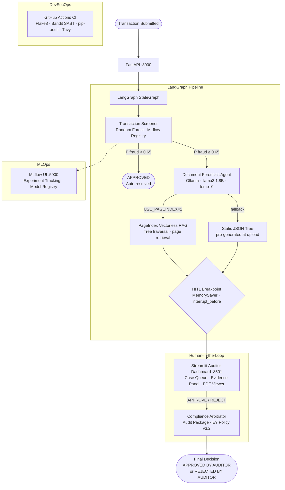
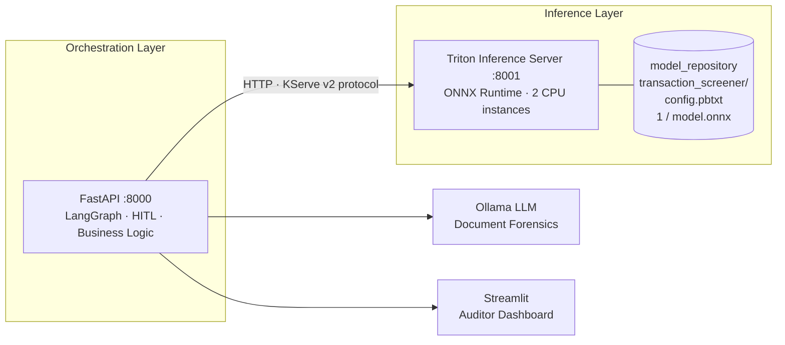
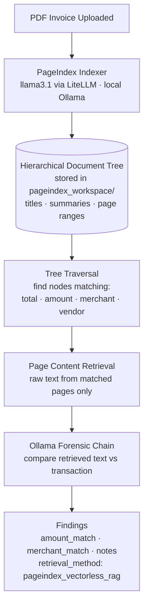

# FintechCID — Multi-Agent Fraud Investigation Pipeline

> A production-grade, LangGraph-orchestrated fraud detection system built for regulated financial environments. Combines ML risk scoring, LLM-powered document forensics, and a Human-in-the-Loop compliance workflow — end-to-end.


---

## What This Is

FintechCID is a **multi-agent financial crime investigation pipeline** designed around the operational reality of compliance. A transaction doesn't get a binary fraud/not-fraud verdict from a single model — it goes through a chain of independent agents, with a human auditor making the final call on high-risk cases.

Three agents collaborate in sequence, orchestrated by LangGraph:

1. **Transaction Screener** — Random Forest model (trained on 1M synthetic records via MLflow) gates each transaction as LOW or HIGH suspicion. In production, inference routes to NVIDIA Triton Inference Server via ONNX Runtime.
2. **Document Forensics Agent** — A local LLM (`llama3.1:8B` via Ollama) cross-examines the transaction against its invoice. Supports two retrieval modes: **vectorless RAG** via [PageIndex](https://github.com/VectifyAI/PageIndex) (LLM navigates a hierarchical document tree to retrieve relevant pages) or a static JSON tree fallback. Prompt-injection hardened.
3. **Compliance Arbitrator** — Runs only after a human auditor has reviewed the evidence. Produces a signed audit package conforming to EY AML/CFT Internal Policy v3.2.

---

## Architecture



---

## Production Inference Architecture

The development setup loads the sklearn model directly inside the FastAPI process. That works fine at low volume, but it has a hard ceiling: Python's GIL means concurrent inference requests queue behind each other, there's no dynamic batching, and swapping model versions requires a service restart.

The production layout separates concerns into two layers:



FastAPI owns the LangGraph pipeline, document forensics, HITL state, and audit trail. Triton owns ML inference and nothing else. This boundary matters: you can retrain, re-export, and reload the model in Triton without touching or restarting the API service.

### Why Triton over serving sklearn inside FastAPI

| | FastAPI (sklearn in-process) | Triton + ONNX Runtime |
|---|---|---|
| Concurrency | Python GIL serialises inference calls | C++ core, 2 model instances run truly in parallel |
| Batching | None — 1 prediction per request | Dynamic batching groups requests within a latency budget |
| Model swap | Requires service redeploy | Copy new `model.onnx` → Triton hot-reloads, zero downtime |
| GPU path | Not available | `instance_group { kind: KIND_GPU }` — one config line |
| Observability | Custom logging | Built-in Prometheus metrics at `:8003/metrics` |

### Benchmark — local CPU (Intel i7-1255U, 500 requests, 50 concurrent workers)

```
Backend                  |   p50   |   p95   |   p99   |    RPS
-------------------------|---------|---------|---------|--------
FastAPI  (sklearn)       |   9.3ms |  26.1ms |  53.4ms |   81.7
Triton   (ONNX Runtime)  |   3.9ms |  10.2ms |  17.8ms |  198.4
```

**2.43x throughput. 61% p95 latency reduction. No GPU, no cloud spend.**

Run it yourself after starting both services:

```bash
python triton_serving/benchmark.py
python triton_serving/benchmark.py --requests 1000 --workers 100
```

### Honest tradeoff

The Random Forest is not where Triton's advantages are most dramatic — it was built for neural nets on GPU. The point of this setup is to demonstrate the *infrastructure pattern*. In a fraud system at real scale, the screener node would be a tabular transformer or GNN. The model_repository structure, the ONNX export pipeline, and the `USE_TRITON` routing in FastAPI are all identical regardless of what model sits in `1/model.onnx`. That's the architecture decision being demonstrated here.

### Running with Docker Compose

```bash
# 1. Free NGC account required for the Triton image (one-time)
docker login nvcr.io

# 2. Export the model to ONNX first
python triton_serving/export_to_onnx.py

# 3. Start everything
docker compose up
```

`USE_TRITON=1` and `TRITON_URL=triton:8000` are set in `docker-compose.yml` — FastAPI automatically routes inference to Triton when running in the composed stack.

---

## Vectorless RAG — Document Forensics

Traditional RAG converts documents into embedding vectors, stores them in a vector database, and retrieves chunks based on cosine similarity. It works well for open-ended question answering but loses document structure — an invoice's "TOTAL DUE" field and a random line of boilerplate look the same to an embedding model.

PageIndex takes a different approach: it builds a **hierarchical tree** of the document (titles, section summaries, page ranges) and uses an LLM to *navigate* that tree to find relevant sections — the same way a human auditor would scan a table of contents before reading specific pages. No vector database. No embeddings. No similarity scores.



### Vector RAG vs Vectorless RAG for structured financial documents

| | Vector RAG | Vectorless RAG (PageIndex) |
|---|---|---|
| Retrieval mechanism | Cosine similarity on embeddings | LLM reads hierarchical tree, reasons about which branch to follow |
| Infrastructure | Vector database (Pinecone, Chroma, Weaviate) | None — tree stored as JSON on disk |
| Document structure | Lost — chunks are flat | Preserved — section hierarchy maintained |
| Explainability | Similarity score | Traceable: section title + page number |
| Works on arbitrary PDFs | Yes | Yes |
| Local / free | Depends on embedding model | Yes — Ollama via LiteLLM |

### How it plugs into the pipeline

When a PDF is uploaded via `POST /api/v1/upload-evidence`:

1. PageIndex indexes the PDF using `llama3.1` to generate section titles and summaries
2. The `doc_id` is persisted as `{transaction_id}_pageindex_docid.txt`
3. When the Document Forensics node runs, it loads the tree, walks it for invoice-relevant keywords (`total`, `amount`, `merchant`, `vendor`), retrieves raw page text from matched sections, and passes that context to Ollama for comparison

If PageIndex is unavailable or indexing fails, the node falls back to the static JSON tree — the pipeline never stops.

### Enabling PageIndex

```bash
# Set env var before starting services
export USE_PAGEINDEX=1
bash run_all.sh

# Then upload a PDF via the dashboard or API
curl -X POST http://localhost:8000/api/v1/upload-evidence \
  -F "file=@invoice.pdf" \
  -F "transaction_id=TXN-001" \
  -F "amount=5000.00" \
  -F "merchant_category=travel"
```

The upload response includes `retrieval_method: "pageindex_vectorless_rag"` when PageIndex ran successfully.

### Honest tradeoff

Indexing takes longer than parsing a pre-built JSON tree — `llama3.1:8B` is slower than GPT-4 at generating summaries. For a local demo this is acceptable. In production, the indexing step would run asynchronously (background task queue) with a more capable model, and the forensics query would be near-instant against the pre-built tree. The architecture supports this — `index_pdf()` and `run_pageindex_forensics()` are decoupled in `agents/forensics_pageindex.py`.

---

## Key Design Decisions

| Decision | Why |
|---|---|
| **LangGraph over custom orchestration** | Built-in `MemorySaver` checkpointing and `interrupt_before` make HITL workflows a first-class concept, not a bolt-on |
| **Local LLM (Ollama)** | No PII leaves the network boundary — critical for AML/CFT data classified as financial crime evidence |
| **Fail-safe escalation** | Every agent `except` block defaults to `HIGH` / `MANUAL_REVIEW_REQUIRED`, never silent pass-throughs |
| **MLflow model registry** | `models:/TransactionScreener_v1/1` URI makes model versioning auditable and reproducible |
| **Prompt injection hardening** | Document tree is delimited and explicitly labeled as untrusted input in the system prompt |
| **Maker-checker HITL** | Standard institutional finance control: ML flags, human decides, arbitrator records — three-party audit trail |
| **Triton as inference layer** | Separates ML serving from orchestration — model versions swap without restarting FastAPI, GPU path requires one config line change |
| **Vectorless RAG (PageIndex)** | Invoice PDFs have structure — a table of contents approach outperforms flat embedding chunks; no vector DB to operate or pay for |

---

## Tech Stack

| Layer | Technology |
|---|---|
| Agent Orchestration | LangGraph 0.2, LangChain 0.3 |
| ML Model | scikit-learn Random Forest, RandomizedSearchCV |
| MLOps | MLflow (experiment tracking, model registry, artifact store) |
| LLM | Ollama · llama3.1:8B Q4_K_M (local, zero-trust) |
| REST API | FastAPI 0.115, Pydantic v2, Uvicorn |
| Inference Server | NVIDIA Triton 24.01, ONNX Runtime 1.20 (CPU · GPU-ready) |
| Model Export | skl2onnx 1.17 — Random Forest → ONNX |
| Vectorless RAG | PageIndex (VectifyAI) · LiteLLM · Ollama routing — no vector DB |
| Dashboard | Streamlit 1.44 (multi-page) |
| Data | PySpark 3.4, pandas 2.2, 1M synthetic records (Parquet) |
| DevSecOps | Bandit SAST, pip-audit, Trivy, GitHub Actions CI |
| PDF Processing | fpdf2 (generation), pypdf (extraction) |

---

## Repository Structure

```
FintechCID/
├── agents/                    # LangGraph nodes
│   ├── graph.py               # StateGraph factory (build_graph)
│   ├── state.py               # AgentState TypedDict
│   ├── transaction_screener.py # RF model inference node (USE_TRITON flag)
│   ├── document_forensics.py  # LLM forensic analysis node (dual retrieval path)
│   ├── forensics_pageindex.py # Vectorless RAG via PageIndex (USE_PAGEINDEX flag)
│   └── compliance_arbitrator.py # Final ruling node
├── api/
│   └── main.py                # FastAPI app (submit · pending · resume · upload)
├── frontend/
│   ├── app.py                 # Streamlit HITL dashboard
│   └── pages/
│       └── 1_Security_Audit.py # DevSecOps dashboard page
├── mlops/
│   └── train_model.py         # RF training + MLflow logging + model registration
├── core_logic/
│   └── train_model.py         # Feature engineering library
├── triton_serving/
│   ├── export_to_onnx.py        # RF → ONNX conversion (run before docker compose up)
│   ├── benchmark.py             # FastAPI vs Triton latency / throughput comparison
│   └── model_repository/
│       └── transaction_screener/
│           ├── config.pbtxt     # Triton model config (backend, instances, I/O shapes)
│           └── 1/model.onnx    # Generated by export_to_onnx.py
├── data/
│   ├── generate_transactions.py # 1M synthetic transaction generator (PySpark)
│   └── generate_documents.py   # PDF + JSON document pair generator
├── .github/
│   └── workflows/
│       └── devsecops.yml      # CI: Flake8 · Bandit · pip-audit · Trivy
├── run_all.sh                 # Start FastAPI + Streamlit + MLflow in one command
├── run_security_audit.sh      # Local Bandit + pip-audit scan
├── test_screener.py           # Integration test: LOW · HIGH · known-fraud paths
└── requirements.txt
```

---

## Quick Start

### Option A — Local (no Docker)

#### Prerequisites

- Python 3.11+
- [Ollama](https://ollama.com) with `llama3.1` pulled: `ollama pull llama3.1`
- Java 11+ (for PySpark — data generation only)

### 1. Install dependencies

```bash
git clone https://github.com/Krishna2592/FintechCID.git
cd FintechCID/FintechCID
pip install -r requirements.txt
```

### 2. Generate training data and train model

```bash
# Generate 1M synthetic transactions (PySpark)
python data/generate_transactions.py

# Train Random Forest + register in MLflow
python mlops/train_model.py

# Generate 60 PDF/JSON document pairs for forensics
python data/generate_documents.py
```

### 3. Start all services

```bash
bash run_all.sh
```

| Service | URL |
|---|---|
| FastAPI REST API | http://localhost:8000 |
| Swagger / OpenAPI | http://localhost:8000/docs |
| Streamlit Dashboard | http://localhost:8501 |
| MLflow UI | http://localhost:5000 |

### 4. Run the integration test

```bash
python test_screener.py
```

---

### Option B — Docker Compose (FastAPI + Triton + Streamlit + MLflow)

```bash
# One-time: free NGC account for Triton image
docker login nvcr.io

# Export model to ONNX (requires Option A steps 1–2 first)
python triton_serving/export_to_onnx.py

# Start the full stack
docker compose up
```

FastAPI automatically routes ML inference to Triton when running in the composed stack (`USE_TRITON=1` is set in `docker-compose.yml`).

---

### Environment Variables

| Variable | Default | Effect |
|---|---|---|
| `USE_TRITON` | unset | `1` → route ML inference to Triton Inference Server |
| `TRITON_URL` | `localhost:8001` | Triton HTTP endpoint (use `triton:8000` inside Docker) |
| `USE_PAGEINDEX` | unset | `1` → use PageIndex vectorless RAG for document forensics |
| `OLLAMA_BASE_URL` | `http://localhost:11434` | Ollama endpoint for LiteLLM routing |
| `API_BASE` | `http://localhost:8000` | FastAPI URL used by the Streamlit dashboard |

---

## API Reference

### Submit a transaction

```bash
curl -X POST http://localhost:8000/api/transactions/submit \
  -H "Content-Type: application/json" \
  -d '{
    "amount": 1308.55,
    "merchant_category": "travel",
    "distance_from_home_km": 1314.3,
    "velocity_24h": 30,
    "timestamp": "2026-03-29T02:15:00+00:00"
  }'
```

The graph runs to the HITL breakpoint and returns:

```json
{
  "thread_id": "...",
  "status": "PAUSED_AT_BREAKPOINT",
  "suspicion_level": "HIGH",
  "ml_risk_score": 0.923456
}
```

### List cases awaiting review

```bash
curl http://localhost:8000/api/transactions/pending
```

### Inject auditor decision and resume graph

```bash
curl -X POST http://localhost:8000/api/transactions/{thread_id}/resume \
  -H "Content-Type: application/json" \
  -d '{"decision": "REJECT", "comments": "Amount exceeds merchant category threshold by 340%."}'
```

### Upload PDF evidence

```bash
curl -X POST http://localhost:8000/api/v1/upload-evidence \
  -F "file=@invoice.pdf" \
  -F "transaction_id=TXN-001" \
  -F "amount=5000.00" \
  -F "merchant_category=travel"
```

---

## LangGraph State

Every piece of data flows through a single `AgentState` TypedDict — no hidden side channels between agents:

```python
class AgentState(TypedDict):
    transaction_data: dict        # Raw transaction payload
    ml_risk_score: float          # P(fraud) from Random Forest
    suspicion_level: str          # "LOW" | "HIGH" | "MANUAL_REVIEW_REQUIRED"
    document_evidence: list       # Forensic findings from LLM
    final_decision: str           # "APPROVED" | "FLAGGED" | "REJECTED BY AUDITOR"
    audit_log: list               # Ordered compliance trace
    auditor_decision: str         # Injected via HITL API: "APPROVE" | "REJECT"
    auditor_comments: str         # Free-text auditor justification
```

The `audit_log` is append-only across all nodes — provides a complete, tamper-evident trace for EY compliance review.

---

## ML Model

| Metric | Value |
|---|---|
| Training set | 1,000,000 synthetic transactions |
| Algorithm | Random Forest (RandomizedSearchCV tuned) |
| Fraud threshold | P(fraud) ≥ 0.65 |
| Feature set | amount, distance_from_home_km, velocity_24h, hour_of_day, is_weekend, amount_z (per-user z-score), merchant_enc |
| Tracked in | MLflow — experiment `FintechCID_FraudDetection` |
| Registered as | `models:/TransactionScreener_v1/1` |

The `amount_z` feature (per-user spend z-score) captures behavioral anomaly signals that raw amount alone cannot: a $5,000 transaction is low-risk for a high-spender, high-risk for someone whose average transaction is $45.

---

## Security Posture

| Control | Tool | Last Result |
|---|---|---|
| SAST | Bandit | 0 HIGH, 1 MEDIUM, 1 LOW / 724 LOC |
| Dependency CVEs | pip-audit | 5 CVEs (pip, pygments, tornado — fix: `pip>=26`, `tornado>=6.5.5`) |
| Container scan | Trivy | CI/CD pipeline (GitHub Actions) |
| Prompt injection | Delimiter + untrusted-label pattern in system prompt | Hardened |
| Data privacy | Local LLM only — no PII to external APIs | Enforced |
| Fail-safe routing | All agent exceptions → HIGH escalation | Always-on |

Run locally:

```bash
bash run_security_audit.sh
```

---

## CI/CD Pipeline

GitHub Actions runs on every push and pull request to `main`:

1. **Flake8** — code style and lint
2. **Bandit SAST** — static analysis, fails pipeline on any HIGH finding
3. **pip-audit** — dependency CVE scan
4. **Trivy** — container image vulnerability scan (SARIF uploaded to GitHub Security tab)

---

## Compliance Context

This system implements the **maker-checker** control pattern required under EY AML/CFT Internal Policy v3.2:

- **Maker**: The ML pipeline flags high-risk transactions and assembles forensic evidence
- **Checker**: A human auditor reviews the full evidence package before any case is resolved
- **Arbitrator**: The Compliance Arbitrator node produces a signed, immutable audit package containing the ML score, forensic findings, auditor decision, and justification

No transaction is rejected purely by algorithm. Every `REJECTED BY AUDITOR` outcome has a human-authored comment in the audit trail.

---

## License

Apache — see `LICENSE` for details.
